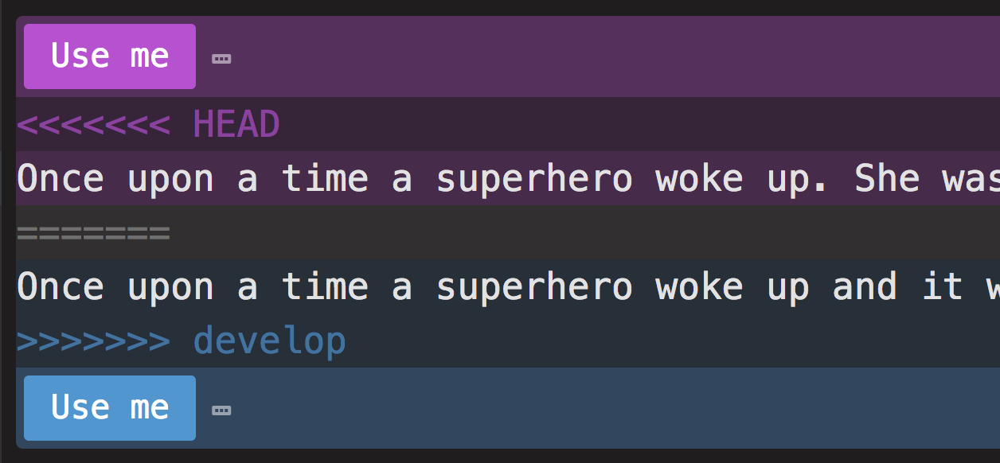

# Advanced Git

## Learning Objectives
- Know Git naming conventions
- Be able to create and move between branches
- Understand the difference between implicit and explicit merges
- Be able to merge branches and resolve merge conflicts
- Be able to use pull requests to merge branches
- Be able to apply Git hygiene
- Be able to use Git as part of a team

## Introduction

We have been using GitHub as a versioning tool to enable us to go back to previous version of our code. Git has a feature called branching that allow us to create parallel versions of our projects, so as to ensure we always have a stable version readily available. GitHub also has a whole host of features that allows developers to collaborate on projects, working on the code simultaneously.

## Git's Master Branch

Until now we have been working on one branch, the 'master' branch. In a Git initialised directory, you will see the word 'master' after the directory name in the terminal. This is the default branch that is created when we create a Git directory.

Until now, every time you have been committing your changes, you have been committing to master. You have then been able to use git commands to go back to a previous version of your code. One problem with this process is that it can be difficult to find the commit relating to the version you want to go back to. Branches help with this problem.

## Git Branches

With branches, once we have a stable version of a program committed to git and we are about to add a new piece of functionality or refactor the code in some way, we can create a new branch. This creates a copy of the code. The new branch will be in the same state as the branch you branches off. Now you can work in the new branch, adding your new feature or refactoring, knowing that you have a stable version back on the original branch should you decide to abandon the feature or you decide the refactor wasn't an improvement.

### Branch Naming Conventions

Permanent Branches:

- Master is the name of the default branch. This should always contain stable working code.
- Develop is often used as the branch for a stable version of code, that is being added to regularly during the development process. Like Master, it should always contain working stable code.

Temporary Branches:

- Feature branches are used to develop new functionality. The naming convention is 'feature/name_of_feature'. These branches are deleted after the feature is merged into develop.
- Fix branches are used to fix a bug. There are different conventions, but you can use something to indicate it's purpose like, 'fix/name_of_fix'. These branches are deleted after the fix is merged into develop.

## Task (30 mins)

In pairs work through the following steps to create and merge branches and deal with any git conflicts. Work through the steps together, so you understand each part of the process.

You are going to start with a master and a develop branch. Then you are going to be making feature branches and merging them into develop.

## Person One

Person One is going to start by creating the directory structure and a develop branch.

### Master branch

1. Create a local directory called `superhero` and initialise git inside it - `git init`
2. Create a new repo on GitHub and add it as the remote of your local directory
3. Create a file called superhero.txt inside the directory
4. Commit and push the changes

We now know that the local and remote master branch are the same.

### Develop branch

1. Create a develop branch off of master - `git checkout -b develop`. (The `-b` flag indicates you are making a new branch, and it is followed by the name of the branch. This command will move you into develop, so you will see the word 'develop' in your terminal, next to the directory name.)
2. Add the following text to supehero.txt: `A Day in the Life of a Superhero`.
3. Add and commit your changes.
4. Push to develop branch - `git push origin develop`. We now know the local and remote develop branches are the same. These changes have **only** been committed on the develop branch. The master branch has not been not affected.
5. Add your partner as a collaborator to the repository on GitHub by going to the repository page. Click `settings` then `collaborators` and add a new collaborator. This will enable you to push and pull to the repository directly.

Note: When you move between branches, your editor will automatically update to display the state of the current branch. If you now checked out to master, those changes you have just made will not be displayed in the editor. Then when moving back to develop, they will appear again.

## Person Two

Person Two is going to work on a feature and merge it into develop.

1. Accept the invitation (you will have been sent an email).
2. Clone the repo. You will now have all the branches.
3. Checkout to the develop branch - `git checkout develop`. (Notice there is no -b flag in the command because we are not creating a new branch, we are checking out to an exiting branch).
4. Create a new new feature branch - `git checkout -b feature/add_story` - notice we are branching off of the develop branch, so our new branch will be the same as develop.
6. Add the following text to supehero.txt: `Once upon a time a superhero woke up. She was tired of fixing all mess made by the humans. So she stayed at home, watched and ate ice cream.`
7. Add and commit the changes
8. Push to the feature branch - `git push origin feature/add_story`.

We know that feature/add_story local and remote branches are the same.

### Merging

Person two is happy that their feature branch is finished, and now wants to integrate their changes into develop. However, person two doesn't know if someone else has made changes to develop while they have been working on feature/add_story so they need to start by getting the latest version of develop.

1. Checkout develop - `git checkout develop`.
2. Pull develop - `git pull origin develop` - we now know that develop remote and local are the same so we can go ahead with the merge.

The end goal is having all our changes integrated into develop.

The principle of merging is that we first merge the stable branch (develop) into the feature branch, so we can fix any conflicts in the feature branch, before merging into develop. This means that develop is always stable.

If there were changes on develop, complete the following steps, otherwise jump to 'Merging Feature into Develop':

1. Checkout the to feature branch - `git checkout feature/add_story` - we know that local and remote at the same because we just pushed up the changes.
2. Merge develop into add_story - `git merge develop`. You can think of the merge command as "pulling" the branch specified in the command into your current branch. Make sure you are in your feature branch. We want to deal with any conflicts in the feature before merging into develop.
3. Deal with any conflicts
4. Add & Commit
5. Push to feature branch - `git push origin feature/add_story` - we now know local and remote of our feature are the same and that we have the latest version of develop integrated with our changes.

#### Merging Feature into Develop

Now want to merge our feature into develop:

1. Checkout develop - `git checkout develop`.
2. Do a pull on develop just to double check no new changes have been made in the meantime - `git pull origin develop` and as long as there haven't been...
3. Merge feature/add_story into develop - `git merge feature/add_story`
4. Push to develop - we now know that the local and remote are the same in develop and our feature branch has been merged.

## Merging with conflicts

Each person is now going to work on a branch simultaneously, and a conflict is going to be created that you will need to handle.

Each person should:

1. Double check they have all the latest changes on develop.
2. Make their own feature branch, one called 'feature/ending' the other 'feature/beginning'. These branches should be created by branching off develop.
3. Person One should edit the beginning of the story and Person Two should edit the end (change the existing text, don't just add to it). Both push the changes to the retrospective feature branches.
3. Both should follow the above merging process. If there is a merge conflict while you are merging develop into your feature branch, your text editor will open with the file where there is a conflict, and both versions will be shown.

*Unresolved Git Conflict in the Editor*

The 'head' section shows your branches state, and the 'develop' section shows the state of the develop branch. You need to edit the file to be how you want it, check your code still runs, then add, commit and push the changes to your feature branch.

Now you know your feature branch has all the latest changes from develop integrated, so you can merge it back into develop without any issues.

## Merge into Master

Finally merge develop into master following the same merging process as above.

## Conclusion

You have now followed a work-flow that enabled you to simultaneously have multiple people working on the same project using branches, ensuring that you always have two stable versions of the code (on the master and develop) branch. This means that at any point in time your have a working application.
